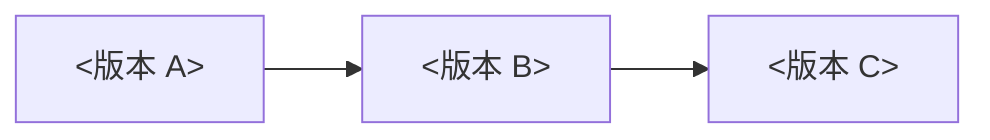

# {{项目名}} 功能演进矩阵

## 1. 文档职责

跨版本能力演进的聚合视图；只做索引，不复制各版本文档的规则。版本边界仍以[版本路线图](版本路线图.md)为准。

## 2. 状态口径

| 状态 | 含义 |
| --- | --- |
| 已发布 | 在当前生产版本可用 |
| 活跃开发 | 当前版本范围内，按功能状态推进 |
| 规划中 | 已确定归属版本，尚未进入开发 |
| 候选 | 有方向但未冻结归属 |

## 3. 跨版本总览

### 3.1 版本主链路

```text
<版本 A> -> <版本 B> -> <版本 C>
```

### 3.2 能力演进热力图

<可用 Mermaid 或表格；只表达有无与粗粒度变化>

### 3.3 详细矩阵

| 能力域 | 能力 | {{活跃版本}} | <后续版本> | 权威文档 |
| --- | --- | --- | --- | --- |
| <领域> | <能力> | <状态/范围摘要> | <规划摘要> | [功能主文档](../03-功能规格/{{活跃版本}}/01-领域/01-功能主文档.md) |

## 4. 分域演进

<!-- 按领域拆节；每节只列出本域能力的版本变化摘要，链接到权威文档 -->

### 4.1 <领域>

| 能力 | 变化 | 版本 | 权威文档 |
| --- | --- | --- | --- |

## 5. 门禁依赖图



## 6. 维护规则

1. 本矩阵只聚合，不新增规则；某项能力变化必须能指向功能主文档或版本规划。
2. 能力增强导致接口/数据破坏性变化时，登记到冻结决策与文档变更记录。
3. 需要按单个功能查看跨版本时间线时，可另建“具体功能演进索引”，但不得与功能文档并列为第二事实源。