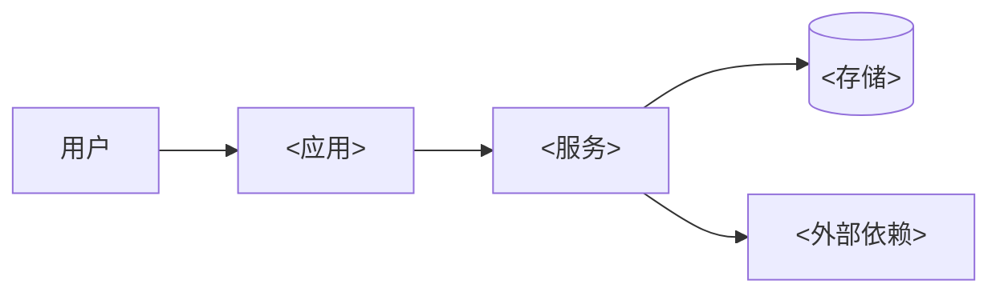
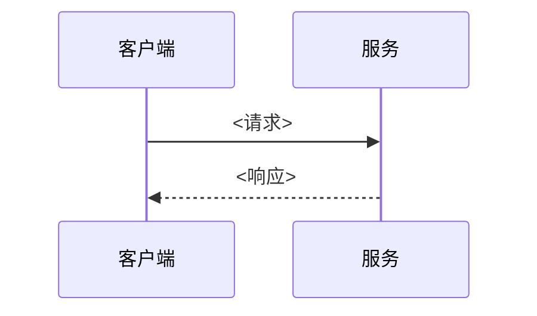

# {{活跃版本}} 总体架构

## 1. 架构结论

### 1.1 系统上下文

### 1.2 容器与运行依赖

| 组件 | 形态 | 依赖 |
| --- | --- | --- |

## 2. 运行应用职责

| 应用 | 职责 | 对外接口 | 不负责 |
| --- | --- | --- | --- |

## 3. 领域职责

| 领域 | 聚合/实体 | 关键规则 |
| --- | --- | --- |

## 4. 请求链路

### 4.1 <链路 A>

## 5. 数据与事务边界

| 场景 | 事务边界 | 幂等策略 | 失败补偿 |
| --- | --- | --- | --- |

## 6. Request ID 与错误

- 所有入口生成或透传 request_id，并跨应用保持一致。
- 错误响应遵循[统一错误码](../统一错误码.md)与[接口契约]({{活跃版本}}-接口契约.md)。

## 7. 部署与扩展

<部署形态、水平扩展前提、共享状态要求>

## 8. 明确不采用

| 方案 | 不采用原因 | 重新评估条件 |
| --- | --- | --- |

## 9. 与总体的差异

<本版本相对[总体架构](../总体架构.md)的临时或新增约束；无则“无”。>