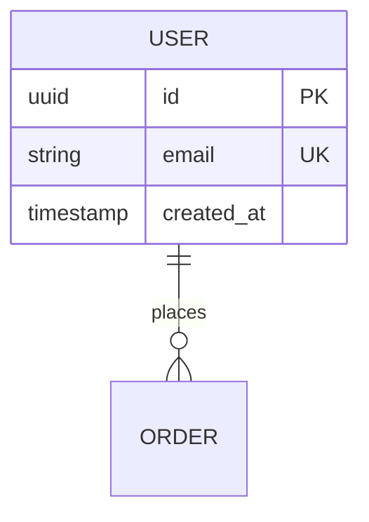

# {{活跃版本}} 数据模型

本文件解释数据**业务含义、约束与演进**；物理事实（列、索引、约束、迁移）以代码库 migration 为准。

## 1. 数据库

| 项目 | 内容 |
| --- | --- |
| 引擎与版本 | <数据库与版本> |
| 初始化方式 | <migration 工具与执行方式> |

### 物理结构权威来源

- migration 目录：`<路径>`
- 本文件只解释约束、状态与演进，不复制完整 DDL。

## 2. 全局实体关系

### 跨域关系与所有权

| 数据 | 所有者 | 允许的跨域访问 |
| --- | --- | --- |

### 关键索引与并发约束

| 表 | 索引/约束 | 目的 |
| --- | --- | --- |

### 迁移顺序与验证

| 迁移 | 内容 | 兼容性 | 验证方式 |
| --- | --- | --- | --- |

## 3. 核心表

### <表名>

| 字段 | 类型 | 约束 | 说明 |
| --- | --- | --- | --- |
| `id` | UUID | PK | |

- 索引：<字段与理由>
- 状态字段与状态机：<引用功能主文档>
- 删除与保留：<软删除/保留期/归档策略>
- 敏感字段：<加密/脱敏要求>

## 4. 数据演进规则

1. 新增字段要贯穿 migration、领域、服务、接口、前端类型。
2. 破坏性变更必须先决策、后迁移，并提供回填与回滚方案。
3. 唯一性、幂等与资金安全约束必须有数据库级兜底，不能只靠应用层。
4. 历史账务与审计记录不得因配置对象变更而失去关联。