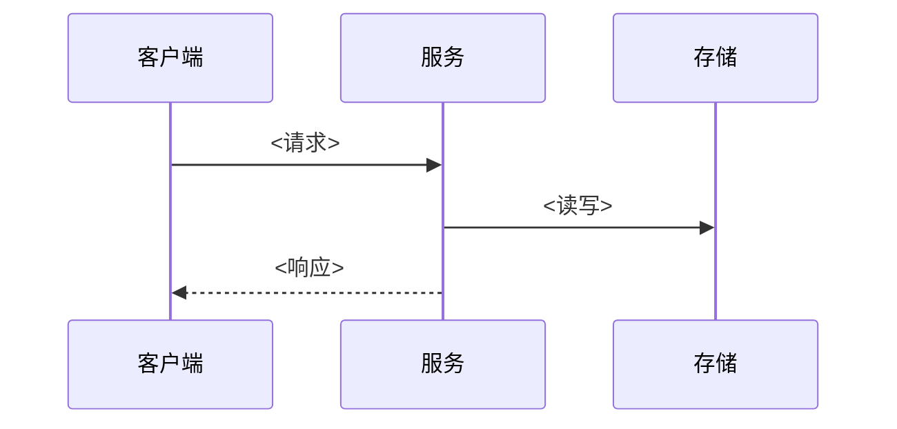

# {{项目名}} 总体架构

<!-- 填写说明：跨版本稳定的架构基线；版本级差异写进 当前版本/Vx-总体架构.md。 -->

## 1. 核心原则

- <例如：单一数据所有权；跨域写入必须走显式接口>
- <例如：金额 Decimal、时间 UTC、列表服务端分页>
- <例如：权限一律服务端校验；日志禁止输出秘密>

## 2. 目录与模块

```text
<仓库根>/
  <应用目录>/          # 运行进程
  <领域/库目录>/        # 领域模块
  {{文档目录}}/        # 文档中心
```

## 3. 运行进程

| 进程 | 职责 | 不负责 |
| --- | --- | --- |
| <进程> | | |

## 4. 领域模块

| 模块 | 职责 | 数据所有权 | 依赖方向 |
| --- | --- | --- | --- |

## 5. 数据边界

| 存储 | 内容 | 权威来源 |
| --- | --- | --- |
| <数据库> | 业务终态数据 | migrations |
| <缓存> | 限流与短期状态 | 可重建，不作为终态 |

## 6. 核心调用链路

### <链路名>



## 7. 拆分条件

<什么情况下才考虑拆分服务/引入新组件；不满足时保持单体优先>
